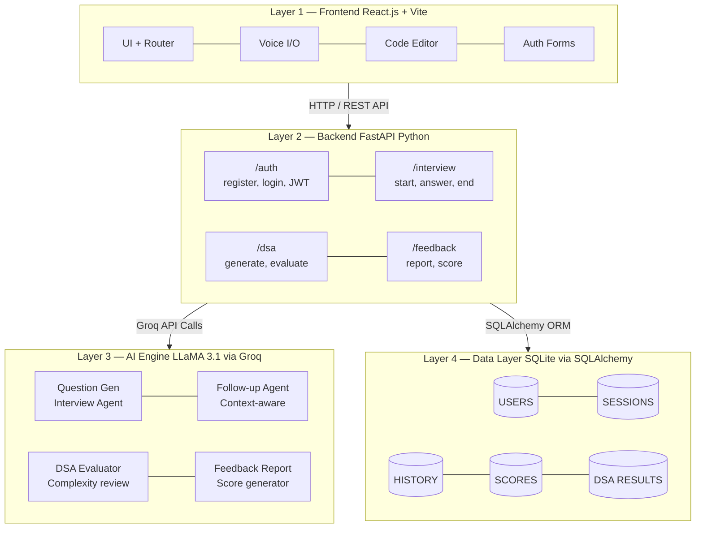

<div align="center">

# 🎙️ MockHire AI Documentation

### AI-Powered Interview & Speaking Skill Simulator

[](https://fastapi.tiangolo.com)
[](https://vitejs.dev)
[](https://groq.com)
[](https://sqlite.org)
[](LICENSE)

*Main Repo. of [MockHire_AI](https://github.com/iamanu26/MockHire_AI)*  |  *Built by [Anurag Dubey](https://portfolio-iamanu26.vercel.app/)*

</div>

---

MockHire AI is a full-stack, AI-driven web application that simulates real-world job interviews through **live voice interaction** and delivers intelligent, structured performance feedback. The platform helps students and job seekers sharpen their interview readiness, communication skills, and technical confidence — in a realistic, pressure-free environment.

---

## ✨ Features at a Glance

| # | Feature | What It Does |
|---|---------|-------------|
| 🧠 | **AI Interview Simulation** | Conducts HR & Technical interviews tailored to your role, company type, and experience level |
| 🎙️ | **Voice-Based Interaction** | Fully hands-free — AI speaks questions, you answer verbally, Web Speech API handles everything |
| 📊 | **AI Feedback Report** | Auto-generates a scorecard across Communication, Confidence, Technical Skills & Grammar |
| 💻 | **DSA Practice Module** | LeetCode-style coding environment with AI-generated problems and code review |
| 🔐 | **JWT Auth & History** | Secure login, per-user session records, and persistent score tracking |

---

## 🏗️ System Architecture

The project follows a **decoupled, layered architecture** — Frontend, Backend API, AI Engine, and Data Layer each operate independently and communicate over clean interfaces.



| Layer | Technology | Role |
|-------|------------|------|
| **Frontend** | React.js + Vite + Web Speech API | User interface, voice I/O, code editor |
| **Backend API** | FastAPI (Python) + JWT + bcrypt | Request routing, auth, business logic |
| **AI Engine** | LLaMA 3.1 via Groq API | Question gen, follow-ups, DSA eval, feedback |
| **Data Layer** | SQLite via SQLAlchemy ORM | Users, sessions, history, scores |

---

## 🔍 Feature Deep Dive

### 01 — 🎙️ Voice Interview Simulation

The AI acts as a real interviewer — it speaks questions aloud via speech synthesis, listens to your spoken answers through the browser's Web Speech API, and sends your response to LLaMA 3.1 to generate the next intelligent, context-aware follow-up.

- Technical & HR interview modes
- Questions tailored to **company type**, **job role**, and **experience level**
- Conversation-aware follow-ups (not random question lists)
- Session isolation — every interview starts fresh with no history bleed

---

### 02 — 📊 AI Feedback Report

After ending a session, your full conversation history is passed to LLaMA 3.1 which generates a detailed performance report — scored and written from what you *actually said*, not a generic template.

| Score Category | What's Evaluated |
|---|---|
| 💬 Communication | Clarity, structure, and coherence of answers |
| 🧘 Confidence | Assertiveness, filler words, hedging language |
| 🔧 Technical Skills | Accuracy and depth of technical responses |
| ✍️ Grammar | Language correctness and professionalism |
| ⭐ Overall | Holistic interview performance score |

> Includes a written **strengths & weaknesses summary** specific to your actual conversation.

---

### 03 — 💻 DSA Practice Module

A LeetCode-style coding environment where every session brings 3 fresh AI-generated problems. Submit your solution and get a detailed code review from the AI.

- **3 problems per session** — Easy, Medium, Hard
- **4 languages supported** — Python, C++, Java, JavaScript
- **Browser-based editor** with line numbers and tab support
- AI reviews for **correctness**, **time complexity**, **space complexity**
- **Score out of 10** per submission

---

### 04 — 🔐 User Auth & History

JWT-based authentication keeps every user's data private, persistent, and secure.

- Register & login with **bcrypt password hashing**
- **JWT access tokens** for protected endpoint security
- Full **per-user interview history** stored in SQLite
- View past session scores and feedback anytime

---

## 🛠️ Tech Stack

<div align="center">

**Frontend**


**Backend**


**AI Engine**


**Database**


</div>

---

## ⚙️ Installation & Setup

### Prerequisites

- Python 3.10+
- Node.js 18+
- A [Groq API key](https://console.groq.com/) (free tier available)

### 1. Clone the Repository

```bash
git clone https://github.com/iamanu26/mockhire-ai.git
cd mockhire-ai
```

### 2. Backend Setup

```bash
cd backend
pip install -r requirements.txt
```

Create a `.env` file inside `backend/`:

```env
GROQ_API_KEY=your_groq_api_key_here
SECRET_KEY=your_jwt_secret_key_here
```

Start the server:

```bash
uvicorn main:app --reload
# API runs on http://localhost:8000
```

### 3. Frontend Setup

```bash
cd frontend
npm install
npm run dev
# App runs on http://localhost:5173
```

---

## 🗂️ Project Structure

```
mockhire-ai/
│
├── backend/
│   ├── main.py                # FastAPI app entry point
│   ├── models.py              # SQLAlchemy DB models (Users, Sessions, Scores...)
│   ├── schemas.py             # Pydantic request/response schemas
│   ├── auth.py                # JWT logic & bcrypt hashing
│   ├── interview_agent.py     # LLaMA interview session manager
│   ├── dsa_agent.py           # DSA problem generator & evaluator
│   ├── feedback.py            # Feedback report generator
│   ├── database.py            # SQLite connection & session
│   └── requirements.txt
│
├── frontend/
│   ├── src/
│   │   ├── components/        # Reusable React components
│   │   ├── pages/             # Route-level page components
│   │   ├── hooks/             # Custom hooks (voice, auth)
│   │   └── App.jsx            # Router & layout
│   ├── index.html
│   └── vite.config.js
│
└── README.md
```

---

## 🧠 Engineering Notes

Non-obvious problems solved during development:

- **Shared agent state bug** — Two separate `InterviewAgent` instances were being created per request, causing feedback to generate against an empty conversation history. Fixed by enforcing a single shared instance per session.
- **LLaMA JSON inconsistency** — LLaMA 3.1 sometimes returns scores as `"7/10"` strings or wraps JSON in markdown fences. Built a custom parser that handles all known output formats robustly.
- **Session isolation** — Added a `/interview/start` endpoint that explicitly clears conversation history, ensuring scores always reflect the *current* interview only — never a previous session.
- **Prompt engineering for fair scoring** — Engineered explicit scoring rubrics in the system prompt to prevent the model from giving inflated scores for low-effort answers. A server-side score cap acts as a final safety net.

---

<div align="center">

**⭐ If MockHire AI helped you prep smarter, give it a star.**

*Built by [Anurag Dubey](https://portfolio-iamanu26.vercel.app/)*

</div>
